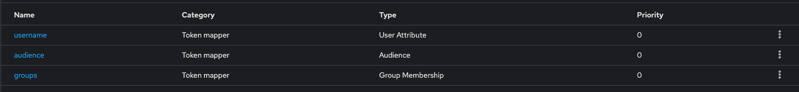
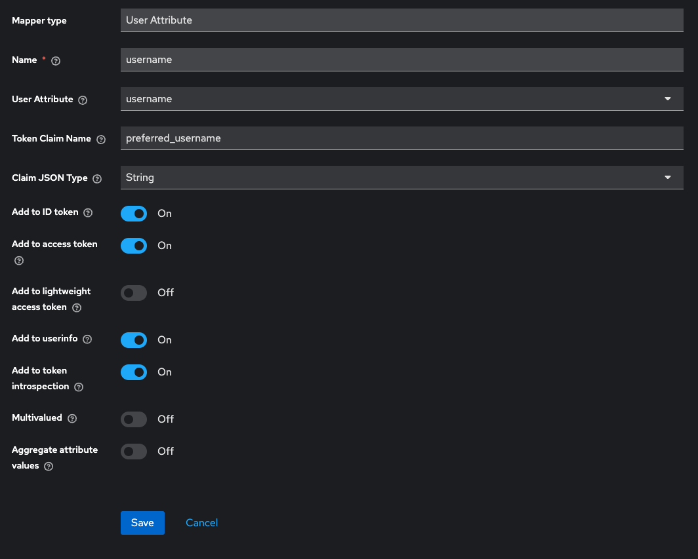
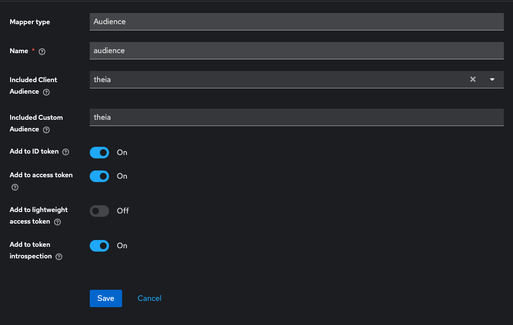
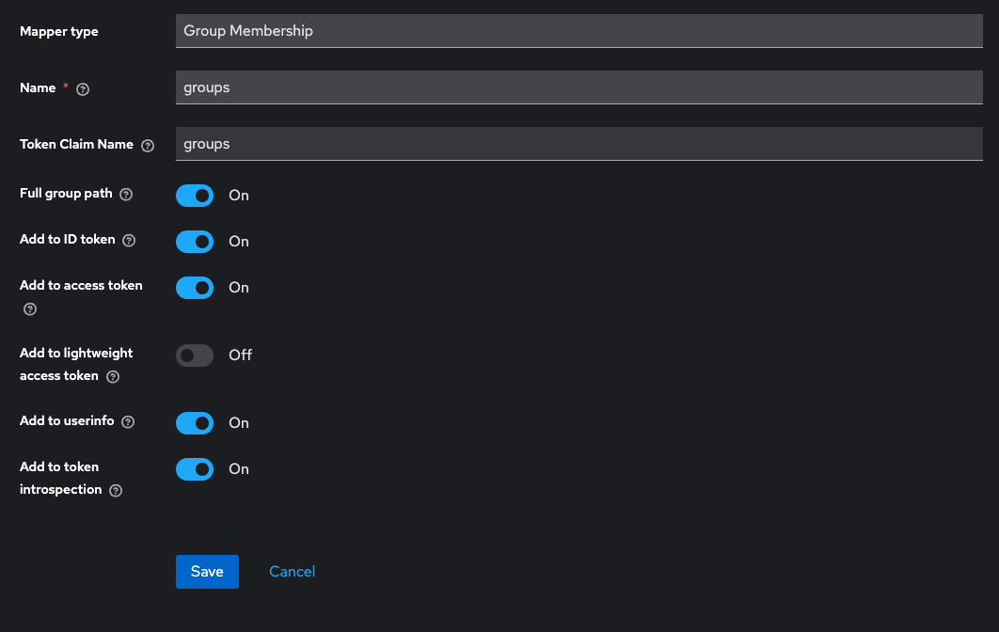

# Theia Deployment

## GitHub Actions Deployment Workflows

This repository uses automated GitHub Actions workflows to deploy Theia Cloud to different environments.

### Deployment Architecture

```
┌────────────────────────────────────────────────────────────────┐
│                          GitHub Actions Workflows              │
├────────────────────────────────────────────────────────────────┤
│                                                                │
│  ┌─────────────┐    ┌──────────────┐    ┌─────────────────┐    │
│  │   PR Push   │    │ Push to main │    │ Manual Trigger  │    │
│  │             │    │              │    │  (GitHub UI)    │    │
│  └──────┬──────┘    └──────┬───────┘    └────────┬────────┘    │
│         │                  │                     │             │
│         ▼                  ▼                     ▼             │
│  ┌─────────────┐    ┌──────────────┐    ┌─────────────────┐    │
│  │deploy-pr.yml│    │deploy-staging│    │deploy-production│    │
│  │             │    │    .yml      │    │     .yml        │    │
│  └──────┬──────┘    └──────┬───────┘    └────────┬────────┘    │
│         │                  │                     │             │
│         └──────────────────┴─────────────────────┘             │
│                            │                                   │
│                            ▼                                   │
│                  ┌──────────────────┐                          │
│                  │  deploy-theia.yml│                          │
│                  │ (Reusable Core)  │                          │
│                  └────────┬─────────┘                          │
│                           │                                    │
└───────────────────────────┼────────────────────────────────────┘
                            │
            ┌───────────────┴───────────────┐
            │                               │
            ▼                               ▼
┌───────────────────────────┐   ┌───────────────────────────┐
│   Production Cluster      │   │  Staging/Test Cluster     │
│   (Separate Kubeconfig)   │   │  (Shared Kubeconfig)      │
├───────────────────────────┤   ├───────────────────────────┤
│                           │   │                           │
│  ┌─────────────────────┐  │   │  ┌─────────────────────┐  │
│  │  theia-prod         │  │   │  │  theia-staging      │  │
│  │                     │  │   │  │                     │  │
│  │  Manual Deploy      │  │   │  │  Auto on main       │  │
│  │  (Approval Req.)    │  │   │  │  (No Approval)      │  │
│  └─────────────────────┘  │   │  └─────────────────────┘  │
│                           │   │                           │
└───────────────────────────┘   │  ┌─────────────────────┐  │
                                │  │  theia-test1        │  │
                                │  │                     │  │
                                │  │  Auto on PR         │  │
                                │  │  (Approval Req.)    │  │
                                │  └─────────────────────┘  │
                                │                           │
                                └───────────────────────────┘

Deployment Triggers:
  • theia-prod:     Manual via GitHub UI → Requires Approval
  • theia-staging:  Automatic on main push → No Approval
  • theia-test1:    Automatic on PR push → Requires Approval (configurable)
```

### Environments

The following environments are configured:

- **theia-prod**: Production environment (separate K8s cluster)
  - Namespace: `theia-prod`
  - Deployment: Manual trigger via GitHub UI only
  - Config: [deployments/theia.artemis.cit.tum.de](deployments/theia.artemis.cit.tum.de/)

- **theia-staging**: Staging environment (same cluster, different namespace)
  - Namespace: `theia-staging`
  - Deployment: Automatically on push to `main` branch
  - Config: [deployments/theia-staging.artemis.cit.tum.de](deployments/theia-staging.artemis.cit.tum.de/)

- **theia-test1**: Test environment (same cluster, different namespace)
  - Namespace: `theia-test1`
  - Deployment: Automatically on PR push (with approval gate)
  - Config: [deployments/theia-test1.artemis.cit.tum.de](deployments/theia-test1.artemis.cit.tum.de/)

### GitHub Environment Setup

For each environment, configure the following secrets and variables in GitHub Settings > Environments:

**Secrets:**

- `KUBECONFIG`: Kubernetes cluster configuration
- `THEIA_WILDCARD_CERTIFICATE_CERT`: Wildcard SSL certificate (base64 encoded)
- `THEIA_WILDCARD_CERTIFICATE_KEY`: Wildcard SSL key (base64 encoded)
- `THEIA_KEYCLOAK_COOKIE_SECRET`: OAuth2 cookie secret
- `THEIA_KEYCLOAK_REALM`: Keycloak realm name
- `THEIA_KEYCLOAK_CLIENT_ID`: Keycloak client ID
- `THEIA_KEYCLOAK_CLIENT_SECRET`: Keycloak client secret

**Environment Protection Rules:**

- **theia-prod**: Require manual approval
- **theia-staging**: No approval required (auto-deploy)
- **theia-test1**: Configure as needed (recommended: approval for team leads)

### Deployment Workflows

#### Pull Request Deployments

When you open a PR, it will automatically deploy to the **test1** environment. You can also manually select an environment to deploy to:

1. Go to Actions > Deploy PR to Environment
2. Click "Run workflow"
3. Select the target environment from the dropdown
4. Click "Run workflow"

#### Staging Deployments

Staging is automatically deployed when changes are merged to the `main` branch via the "Deploy Staging" workflow.

#### Production Deployments

Production must be manually triggered:

1. Go to Actions > Deploy Production
2. Click "Run workflow"
3. Select the `main` branch
4. Click "Run workflow"
5. Approve the deployment when prompted

### Adding New Environments

To add a new environment, follow these steps:

#### 1. Create Deployment Configuration

Create a new directory in `deployments/` with your environment's domain name (e.g., `deployments/theia-test2.artemis.cit.tum.de/`):

```bash
mkdir -p deployments/theia-test2.artemis.cit.tum.de
```

Copy and adjust the values files from an existing environment:

- `values.yaml` - Update hosts, app name, and environment-specific settings
- `theia-base-helm-values.yml` - Update issuer email if needed
- `theia-crds-helm-values.yml` - Usually no changes needed

#### 2. Create GitHub Environment

1. Go to your repository **Settings > Environments**
2. Click **New environment**
3. Enter the environment name (e.g., `theia-test2`)
4. Configure **Environment protection rules** if needed:
   - Add required reviewers for approval gates
   - Set deployment branch rules

#### 3. Configure Environment Secrets

In the newly created environment, add the following secrets:

##### Required Secrets

| Secret Name | Description | How to Obtain |
|-------------|-------------|---------------|
| `KUBECONFIG` | Kubernetes cluster configuration | Export from your K8s cluster: `cat ~/.kube/config` (or get from cluster admin). Use the same kubeconfig as staging/test1 for shared cluster, or separate one for production. |
| `THEIA_WILDCARD_CERTIFICATE_CERT` | Wildcard SSL certificate (base64) | Get the certificate file (`.pem` or `.crt`) and encode: `cat certificate.pem \| base64 -w 0` |
| `THEIA_WILDCARD_CERTIFICATE_KEY` | Wildcard SSL certificate key (base64) | Get the private key file and encode: `cat certificate.key \| base64 -w 0` |
| `THEIA_KEYCLOAK_COOKIE_SECRET` | OAuth2 proxy cookie secret | Generate with: `python -c 'import os,base64; print(base64.urlsafe_b64encode(os.urandom(32)).decode())'` or `openssl rand -base64 32` |
| `THEIA_KEYCLOAK_REALM` | Keycloak realm name | Get from your Keycloak setup (e.g., `Test`) |
| `THEIA_KEYCLOAK_CLIENT_ID` | Keycloak client ID | Get from Keycloak Clients configuration (e.g., `theia-cloud`) |
| `THEIA_KEYCLOAK_CLIENT_SECRET` | Keycloak client secret | Get from Keycloak Clients > Credentials tab. For public clients, use: `publicbutoauth2proxywantsasecret` |

##### Secret Creation Steps

1. Navigate to **Settings > Environments > [your-environment]**
2. Under **Environment secrets**, click **Add secret**
3. For each secret above:
   - Enter the **Name** (exactly as shown in the table)
   - Enter the **Value** (ensure proper encoding for certificates)
   - Click **Add secret**

##### Important Notes

- **Base64 encoding**: Use `-w 0` flag (Linux) or no flag (macOS) to prevent line wrapping
- **Certificate format**: Ensure you're using the correct wildcard certificate for your domain (e.g., `*.webview.instance.theia-test2.artemis.cit.tum.de`)
- **Keycloak setup**: You may need to create a new Keycloak client for the new environment or reuse an existing one
- **Namespace isolation**: Each environment uses its own Kubernetes namespace, but staging/test environments share the same cluster

#### 4. Update Workflow Configuration

Add the new environment to the PR deployment workflow:

1. Edit [.github/workflows/deploy-pr.yml](.github/workflows/deploy-pr.yml)
2. Add the environment to the `options` list under `workflow_dispatch.inputs.environment`:

   ```yaml
   options:
     - theia-test1
     - theia-test2  # Add your new environment
     - theia-staging
     - theia-prod
   ```

3. Add a new job for the environment:

   ```yaml
   deploy-test2:
     if: github.event_name == 'workflow_dispatch' && inputs.environment == 'theia-test2'
     name: Deploy to Test2
     uses: ./.github/workflows/deploy-theia.yml
     with:
       environment: theia-test2
       namespace: theia-test2
       helm_values_path: deployments/theia-test2.artemis.cit.tum.de
     secrets: inherit
   ```

#### 5. Test the Deployment

1. Create a test PR or use workflow dispatch
2. Select your new environment from the dropdown
3. Verify the deployment completes successfully
4. Check the deployed application at your configured domain

## Install Theia Cloud

### Prerequisites

Theia Cloud requires a Kubernetes cluster with the following patch to the ingress-nginx controller to allow snippet annotations (also see [theia-cloud-helm](https://github.com/eclipse-theia/theia-cloud-helm/tree/main):

```bash
kubectl -n ingress-nginx patch cm ingress-nginx-controller --patch '{"data":{"allow-snippet-annotations":"true" "annotations-risk-level": "Critical" }}'
kubectl -n ingress-nginx delete pod -l app.kubernetes.io/name=ingress-nginx
```

### Install Theia Cloud Charts

Make sure to set the namespace to your desired location first. For production, we use `theia-prod`.

```bash
helm repo add theia-cloud-repo https://eclipse-theia.github.io/theia-cloud-helm/
helm repo update

helm upgrade theia-cloud-base theia-cloud-repo/theia-cloud-base --install -f theia-base-helm-values.yml

helm upgrade theia-cloud-crds theia-cloud-repo/theia-cloud-crds --install -f theia-crds-helm-values.yml

helm upgrade --install theia-cloud-combined ./charts/theia-cloud-combined --namespace your-namespace --create-namespace
```

### Installing the Theia Cloud Test Operator

To install the theia cloud test operator, we use the specific yaml file. For other environments, it makes sense to also create a new values file.

```bash
helm upgrade --install theia-cloud-combined ./charts/theia-cloud-combined --namespace $namespace --create-namespace -f value-reference-files/tum-theia-cloud-helm-test-values.yaml
```

## Certificate System

Theia creates a new URI for each session<>plugin combination in the namespace of `*.webview.instance.theia.artemis.cit.tum.de`. Thus, a wildcard certificate is required granting the server the authority to securely handle this namespace.
Our certificates are externally signed by RBG and cannot be renewed nor used by the regular K8s `cert-manager` - we disable it using `ingress.certManagerAnnotations: false` in the helm values.

### Install the *.webview... certificate from TUM

1. Import certificate as secret

```bash
k create secret tls static-theia-cert --cert=./wildcard-webview-cert/__webview_instance_theia_artemis_cit_tum_de.pem --key=./wildcard-webview-cert/wildcard_webview_instance_theia_artemis_cit_tum_de.key
```

2. Make sure to set the `hosts.allWildcardInstances` and `ingress.instances.allWildcardSecretNames` accordingly.

## Add Keycloak Client Scopes

Go to Keycloak realm > Clients > theia-cloud > Client Scopes > theia-dedicated > Mappers and add the following mappers:



- username



- audience



- groups



## Enable Metrics for Theia

The installation of the metrics system is based on the[Theia Cloud Observability](https://github.com/eclipsesource/theia-cloud-observability) project.

### Install Prometheus & Grafana

Based on [this instructions](https://github.com/eclipsesource/theia-cloud-observability/blob/main/kube-prometheus-stack/README.md), we perform the following steps:

1. Configure the system in `theia-prometheus-values.yml`. Make sure to set an appropriate password and adjust the domains.

2. Add repository to install prometheus.

```bash
helm repo add prometheus-community https://prometheus-community.github.io/helm-charts
helm repo update
```

3. Install in wanted namespace

```bash
helm upgrade theia-prometheus-stack prometheus-community/kube-prometheus-stack \
--version 60.2.0 --namespace theia-prometheus-stack --create-namespace --install \
--values theia-prometheus-values.yaml
```

### Install Theia dashboards

The manifests assume default namespaces for both the Theia Cloud and the Prometheus installations. If those namespaces do not match your installation, you have to adapt the manifests.
Follow [these instructions](https://github.com/eclipsesource/theia-cloud-observability/blob/main/kube-prometheus-stack/README.md#installupgrade-additional-manifests) to change the manifests available in the `theia-metrics` directory.

Finally, create the new dashboard: `kubectl apply -f theia-metrics/manifests`.

## Install Custom AppDefinitions

In Theia, *AppDefinition*s are used to define the environment the students work in. They are build in a compley three-stages pipeline [here](https://github.com/ls1intum/artemis-theia-blueprints).
To install them, we use a simplified HelmChart - more configuration is possible and documented-in-code in `./theia-appdefinitions/templates/appdefinition.yaml`. To apply changes to your cluster, run:

```bash
helm dependency update ./charts/theia-cloud-combined
helm upgrade --install theia-cloud-combined ./charts/theia-cloud-combined --namespace your-namespace --create-namespace -f your-custom-values.yaml
```
